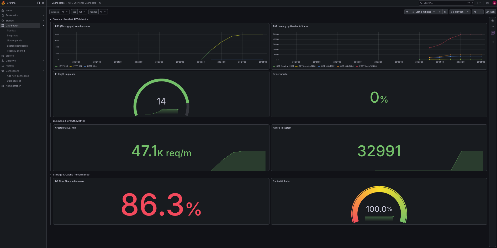

# Platform Example with URL-Shortener

This is an example of a **platform** for a **K3s HA Cluster** with **PostgreSQL and Redis** and a full Observability stack.
An app example written by myself: a **URL-shortener** that automatically generates a short URL and adds it to the database.

[](https://github.com/Zapi-web/url-shortener/actions/workflows/main.yaml)


## Features of Platform
* **K3s HA Cluster**: automatically deploy an HA cluster with 1 command
* **Full Observability Stack**: from logging to traces with the VictoriaMetrics ecosystem and Otel collector
* **Replications**: Single-Leader replication on DB and Cache
* **GitOps**: Cluster deploys only from the git repository
* **Custom Dashboard**: with custom metrics from the database
* **Goose Job Migration**: deploys databases and only then migrates and deploys the app

## Features of App
* **Snowflake & Base62 Encoding**: Fast, collision-free short ID generation with $O(1)$ memory encoding.
* **Caching Layer**: Redis cache with automatic fallback to `fakeCache` if Redis is unreachable.
* **PostgreSQL Storage**: Indexed on `expired_at` for efficient database cleanup routines.
* **Observability**: Built-in VictoriaMetrics integration tracking request counts, latencies, and cache stats.
* **12-Factor App**: Gives the opportunity to customize almost all parameters in the app
* **Cache WaitGroup**: async adding to cache through the `Worker Pool` pattern in Go code

## Tech Stack
* **Go 1.26+**
* **PostgreSQL** (Main database)
* **Redis** (Cache layer)
* **GitHub Actions** (CI/CD for multi-arch images (ARM64 / AMD64))
* **Ansible**
* **OpenTofu**
* **K3s**
* **Docker** (Containerization)
* **Grafana**
* **VictoriaMetrics/Logs/Traces**
* **OpenTelemetry**

## Installation
1. Clone the repo
```bash
    git clone https://github.com/Zapi-web/url-shortener.git
cd url-shortener
```
2. * For local startup without a cluster
```bash
    make start-local-compose
```
* For a local cluster you can use 2 options:
ArgoCD way:
```bash
make start-local-k3d-argo
```
Helmfile way:
```bash
make start-local-k3d-helmfile
```

* Or if you want to deploy the app in AWS Cloud, write `terraform.tfvars` like the example in `infra/tofu`
```bash
KEY_PATH=PATH_TO_YOUR_AWS_KEY make start-aws-k3s-cluster
```
**That's all!**

3. Once you have finished, destroy your cluster with one of the three commands:
```bash
make clean-k3d
make clean-compose
make clean-aws-k3s-cluster
```

## Usage
1. Once Docker is running you can now use curl to shorten a URL
```bash
    curl -X POST http://localhost:8080/api/v1/ \
    -H "Content-Type: application/json" \
-d '{"url": "https://example.com", "user_id": 123}'
```
**Response**
```bash
{"short_url":"2u6dLGX2rZK"}
```
2. Access the short URL in a browser or via curl:
``` bash
    curl -i localhost:8080/2u6dLGX2rZK
```
3. After that you will be redirected to your web page

**P.S.** If you deployed to the cloud, replace **localhost:8080** with your ALB link

## Performance & Benchmarks (k6)

Tested on an AWS k3s Cluster (3 nodes) with **1,000 concurrent VUs** over 5 minutes:

| Architecture | Throughput | p(95) POST | p(95) GET | Median Latency | Success Rate |
| :--- | :--- | :--- | :--- | :--- | :--- |
| **3x t4g.medium** (ARM Graviton2) | 1,617 req/s | 674.78 ms | 674.78 ms | 267.93 ms | 100% |
| **3x m7g.large** (ARM Graviton3) | 2,794 req/s | 353.82 ms | 277.42 ms | 103.52 ms | 99.88% |
| **3x m7a.large** (AMD Zen 4) | **3,206 req/s** | **289.35 ms** | **235.16 ms** | **87.81 ms** | **99.87%** |

* Detailed test logs can be found in the `k6/` directory

## Grafana Dashboard Preview
[](docs/grafana_dashboard.png)
